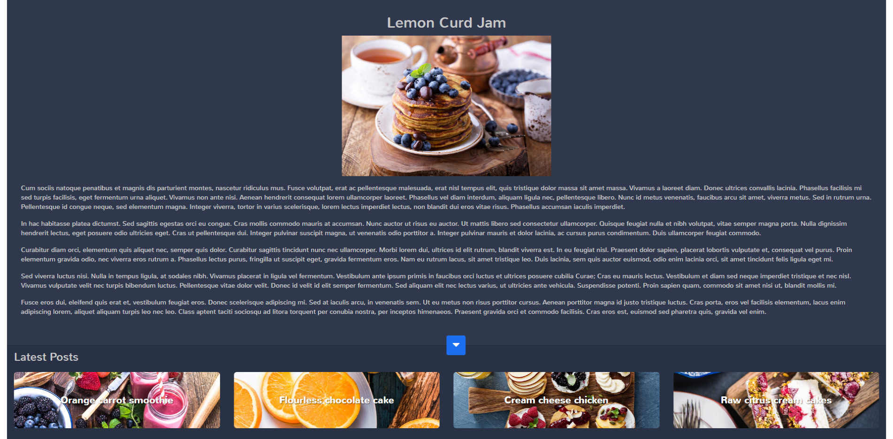

# AngularDynamicHeight
In this tutorial, i have explained how you an dynamically set height of a div of component depending on other div of component.
Here, i have two sections : 1. Top 2. Bottom
After loading, Bottom section is hidden with only Arrow icon. This arrow icon is used to show and hide the content of bottom section.



## resize-comonent-facotry
this factory is being used to define export function "resizeComponent". This "resizeComponent" function can be exported using export keyword. 
The component where you want to use this function, you have to import it.

```
export function resizeComponent(topSectionclassName, bottomSectionclassName) {
    const height = window.innerHeight;
    let bottomSectionHeight = 0;
    if (topSectionclassName && bottomSectionclassName) {
        bottomSectionHeight = document.querySelector<HTMLElement>('.' + bottomSectionclassName).offsetHeight;
        document.querySelector<HTMLElement>('.' + topSectionclassName).style.height = (height - bottomSectionHeight) + 'px';
    }
}
```

## app.component
APPComponent is the parent component of both top and bottom components. So, i have included "resizeComponent" function in app component. 
I am passing the top and bottom panel class names using "resizeComponent" function parameters to calculate the top and bottom component
heights when the content of bottom component is showed or hidden.

```
ngOnInit(): void {
    resizeComponent('top-panel', 'bottom-panel');
  }

  eventNotifyPanelOpen(event) {
    resizeComponent('top-panel', 'bottom-panel');
  }
```

If you resize your window then again "resizeComponent" function should be called.
```
@HostListener('window:resize', ['$event'])
  onResize(event) {
    resizeComponent('top-panel', 'bottom-panel');
  }
```

## bottom-panel.component
After component initialization, bottom panel should be hidden. I have used ElementRef with querySelector to get the DOM element
and add / remove class. 
For better coding, you should keep checking for elementRef and other elements getting undefined or not. Sometimes UI may take time
to rendering then you will get console error. This error will break your functionlities.

```
this.btnArrow = this.elementRef.nativeElement.querySelector('i.fas');
    this.bottomPanel = this.elementRef.nativeElement.querySelector('.bottom-panel');
    this.boxes = this.elementRef.nativeElement.querySelectorAll('.box');
    this.latestPostElem = this.elementRef.nativeElement.querySelector('.latest-posts');
    if (!this.isBottomPanelOpen && this.elementRef && this.btnArrow && this.bottomPanel && this.boxes.length > 0) {
      this.btnArrow.classList.add('fa-caret-up');
      this.setBoxHeight(0, this.boxes);
      this.latestPostElem.style.display = 'none';
    }
```


